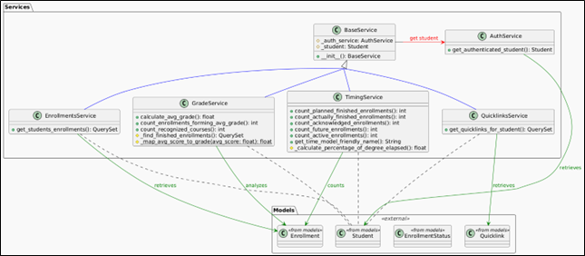
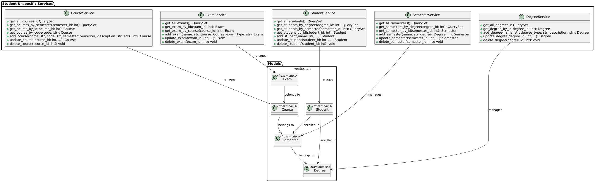
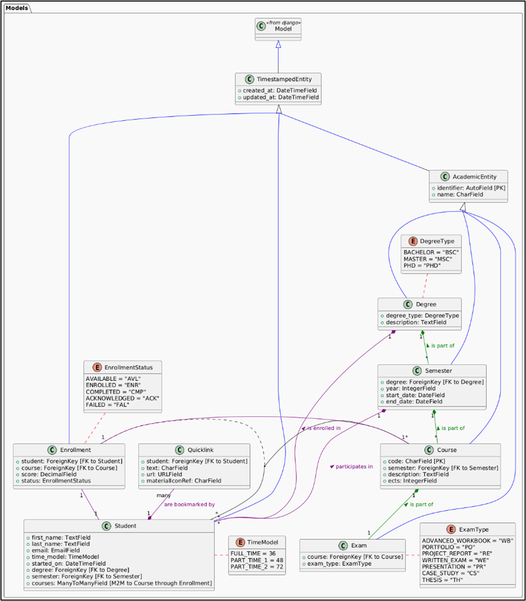
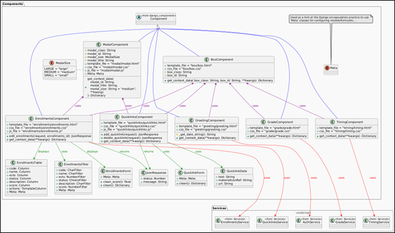

# Responsibilities

This file lists out the most important classes throughout the project and gives insights on what functionality they
provide.

Table of contents

- [Services](#services)
    - [Student specific services](#student-specific-services)
    - [Student unspecific services](#student-unspecific-services)
- [Models](#models)
    - [AcademicEntity](#academicentity)
    - [TimeStampedEntity](#timestampedentity)
    - [UML-representation](#UML-representation)
- [Components](#components)
    - [Visualization components](#visualization-components)
    - [Data components](#data-components)
    - [UML-representation](#UML-representation)

## Services

> Why do we use services and not fat-models? Check out [decisions.md](decisions.md#services).

Services for this project are structured into two: **Student specific** and **student unspecific**.

### Student specific services

These services mainly deal with CRUD actions while a student is logged in the dashboard and is actively interacting with
it. Essentially, there is a 1:1 match from a service to an actual component in the dashboard:

| Service           | Purpose                                                                                                | Related Component      |
|-------------------|--------------------------------------------------------------------------------------------------------|------------------------|
| QuicklinkService  | Manages personal quicklinks including creation, deletion and display of shortcut links                 | components/quicklinks  |
| EnrollmentService | Handles student course enrollments including adding new enrollments and managing existing ones         | components/enrollments |
| GradeService      | Calculates avg. grade for the all of the students enrollments and provides context about that grade    | components/grade       |
| TimingService     | Time-aware service determining the "is" and "should" timings for the students progress in their degree | components/timing      |

As they always provide context for a single student, all of these services use the **AuthService**.
Here is an UML depiction of these classes:

## Student unspecific services

These services - not very surprisingly - deal with all data relevant to **all** students.
As of 08/25 these services are not usable from the dashboard itself, but rather via management commands.
If you want specific usage instructions for them, checkout the projects [README.md](../README.md).

These management commands though rely directly on these services:

- CourseService
- DegreeService
- ExamService
- SemesterService
- StudentService

All of these services have the same purpose. They provide methods to:

- Get all respective objects they manage by whatever attribute one might want to query by.
- Add new instances
- Edit existing instances
- Delete existing instances

These services are depicted as UML here:

## Models

The main responsibility for models in this project is to specify which data is saved in what way.
 
There are two model base classes which provide some default-fields for all models in the project:

### AcademicEntity

This base class provides two fields: **identifier** and **name**. While the purpose of identifier is rather obvious -
providing a primary key for all object - the name may not be that clear. The idea behind the name attribute is to have a
dedicated field where *friendly-name* can be stored. When interacting with the database, one can always directly infer
some context from the name of a database entry without having access to all attributes (columns).

Though this does not make sense for *all* models, therefore only some inherit from this class.

### TimeStampedEntity

This is the other base class available in the project. This class provides the fields **created_at** and
**updated_at** - both are set automatically when creating respectively updating a model instance with no extra effort
for the inheriting models.

Having these time stamps is great feature for auditing when certain data changed.
When implementing an AuthenticationService in the future (ref. Abstract of the Portfolio project) this base class could
be expanded to hold additional accounting information for who changed something, increasing the benefit even more.

### UML-representation

To get an idea, how all of the models "interact" with each other, take a look at this diagram:

## Components

Lastly there are the components visualizing the data saved by models and provided through services.

> Why use components and not just django views? Take a look here: [decisions.md](decisions.md#components)

The components can be roughly split into two groups: **visualization components** and **data components**.

### Visualization components

Visualization component may not be the best term as all components visualize something. But the responsibility of these
types of components is to only provide a *skeleton* to be used in the **data components**.

These components are:

| Component | Purpose                                                                       |
|-----------|-------------------------------------------------------------------------------|
| Modal     | Displays a popover mainly used for contextual actions like data manipulation. |
| Box       | Provides a basic layout for the individual "tiles" in the dashboard.          |

### Data components

These components fulfill the actual set goals for the dashboard. They visualize the data provided by the services.
As the purposes for these components are the exact same as for
the [student-specific services](#student-specific-services) I won't list out the purpose again.

- GradeComponent
- QuicklinksComponent
- TimingComponent
- EnrollmentsComponent

The only other "data component" not having a dedicated service is the **GreetingComponent** - that only has the task to
render out the date and say hello to the user though.

### UML-representation

All of these components are described in this UML diagram:

